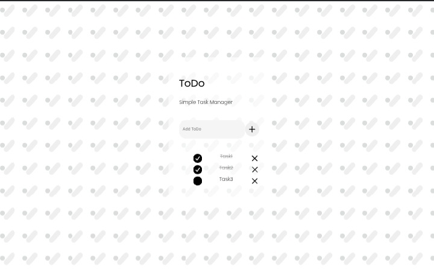
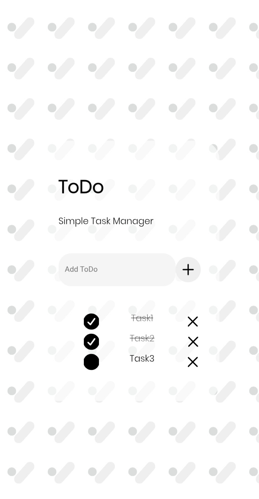

# Todo
## List & Task

initial version of my project, I used HTML, CSS, JS for this project
because I'm just learning CRUD so it's still very basic.

## features
- add task
- delete task
- checked task
- your tasks are saved in local storage 

## preview

## Live Preview
https://alfianolukita.github.io/ToDo

## Author
© AlfianoLukita 2026 
This project is MIT licensed. Youcan use and modify it, but please keep credit. 

## Version v0.0.3
